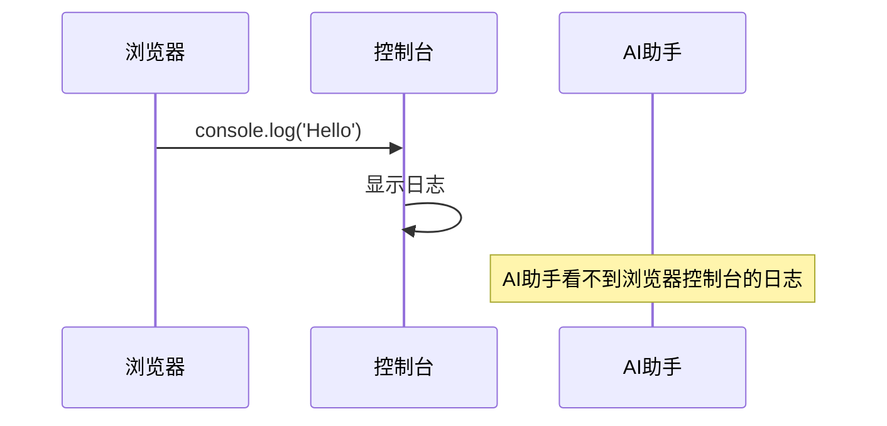
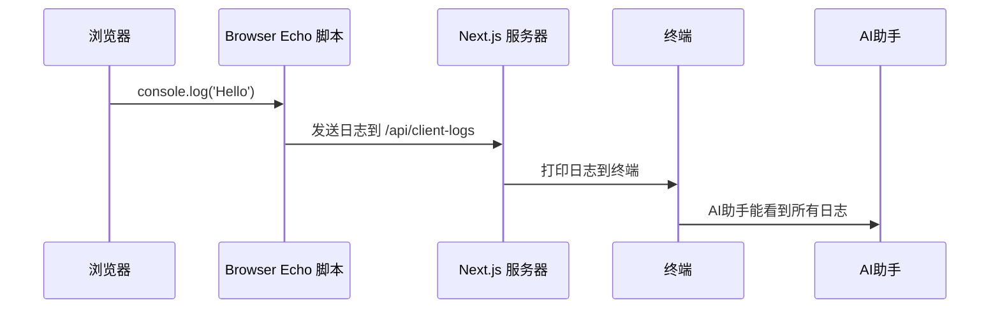
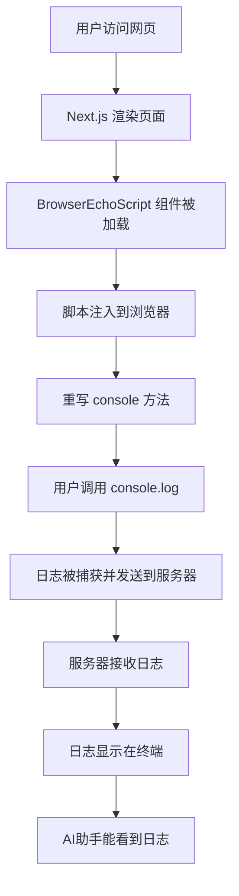

# Next.js 浏览器日志回显指南

## 什么是 Browser Echo？

想象一下，当你在浏览器中写代码时，经常会用 `console.log()` 来调试程序。但是这些日志信息只显示在浏览器的开发者工具中，而你的 AI 助手（比如 Cursor AI）无法看到这些信息。

**Browser Echo 就像一个"传声筒"**，它会把浏览器中的日志信息"传回"到你的开发服务器终端，这样 AI 助手就能看到你在浏览器中发生了什么！

## 为什么需要 Browser Echo？

```mermaid
graph LR
    A[你在浏览器中写代码] --> B[console.log('Hello')]
    B --> C[日志显示在浏览器控制台]
    C --> D[AI助手看不到这些日志]
    D --> E[AI助手无法帮你调试]

    F[使用 Browser Echo] --> G[日志同时发送到服务器]
    G --> H[AI助手能看到所有日志]
    H --> I[AI助手能更好地帮你调试]
```

## 工作原理

### 传统方式的问题



### 使用 Browser Echo 后



## 安装步骤

### 1. 安装包

```bash
npm install -D @browser-echo/next
# 或者
pnpm add -D @browser-echo/next
```

### 2. 自动设置（推荐）

```bash
npx @browser-echo/next setup
```

这个命令会自动创建需要的文件。

### 3. 手动设置

如果你想要更多控制，可以手动设置：

#### 步骤 1：在根布局中添加脚本

```tsx
// app/layout.tsx
import type { ReactNode } from "react";
import BrowserEchoScript from "@browser-echo/next/BrowserEchoScript";

export default function RootLayout({ children }: { children: ReactNode }) {
  return (
    <html lang="en">
      <head>
        {/* 只在开发模式下启用 */}
        {process.env.NODE_ENV === "development" && <BrowserEchoScript />}
      </head>
      <body>{children}</body>
    </html>
  );
}
```

#### 步骤 2：创建 API 路由

```ts
// app/api/client-logs/route.ts
export { POST, runtime, dynamic } from "@browser-echo/next/route";
```

## 详细工作流程



## 配置选项

你可以自定义 Browser Echo 的行为：

```tsx
<BrowserEchoScript
  route="/api/client-logs" // 发送日志的路径
  include={["warn", "error"]} // 只捕获警告和错误
  preserveConsole={true} // 保持原始console行为
  tag="[NextJS Browser]" // 终端显示的标签
  stackMode="condensed" // 堆栈跟踪模式
  showSource={true} // 显示源代码位置
  batch={{ size: 10, interval: 500 }} // 批量发送设置
/>
```

### 配置选项说明

| 选项              | 说明                      | 默认值                                  |
| ----------------- | ------------------------- | --------------------------------------- |
| `enabled`         | 是否启用功能              | `true`（开发模式）                      |
| `route`           | 发送日志的 API 路径       | `/api/client-logs`                      |
| `include`         | 捕获哪些类型的日志        | `['log','info','warn','error','debug']` |
| `preserveConsole` | 是否保持原始 console 行为 | `true`                                  |
| `tag`             | 终端显示的标签            | `[browser]`                             |
| `stackMode`       | 堆栈跟踪显示模式          | `'condensed'`                           |
| `showSource`      | 是否显示源代码位置        | `true`                                  |

## 实际使用示例

### 基本使用

```tsx
// app/page.tsx
"use client";

export default function HomePage() {
  const handleClick = () => {
    console.log("按钮被点击了！");
    console.warn("这是一个警告信息");
    console.error("这是一个错误信息");
  };

  return (
    <div>
      <h1>Hello Browser Echo!</h1>
      <button onClick={handleClick}>点击我测试日志</button>
    </div>
  );
}
```

### 在组件中使用

```tsx
// app/components/UserProfile.tsx
"use client";

import { useState, useEffect } from "react";

export default function UserProfile({ userId }: { userId: string }) {
  const [user, setUser] = useState(null);

  useEffect(() => {
    console.log("正在加载用户信息:", userId);

    fetch(`/api/users/${userId}`)
      .then((response) => {
        console.log("API响应:", response.status);
        return response.json();
      })
      .then((data) => {
        console.log("用户数据:", data);
        setUser(data);
      })
      .catch((error) => {
        console.error("加载用户失败:", error);
      });
  }, [userId]);

  return (
    <div>
      {user ? (
        <div>
          <h2>{user.name}</h2>
          <p>{user.email}</p>
        </div>
      ) : (
        <p>加载中...</p>
      )}
    </div>
  );
}
```

## 与 AI 助手集成

### 使用 MCP 服务器（高级功能）

Browser Echo 还支持 MCP（Model Context Protocol）服务器，让 AI 助手能更智能地处理日志：

```
浏览器日志 → Next.js服务器 → 终端输出 → 基础日志查看
                    ↓
               MCP服务器 → AI助手 → 智能日志分析
```

### 设置 MCP 服务器

1. 安装 MCP 服务器：

```bash
npm install -g @browser-echo/mcp
```

2. 启动 MCP 服务器：

```bash
browser-echo-mcp
```

3. 在 AI 助手中配置 MCP 连接

## 常见问题解答

### Q: 为什么我看不到日志？

A: 确保：

- 你在开发模式下运行（`npm run dev`）
- `app/api/client-logs/route.ts` 文件存在
- `<BrowserEchoScript />` 组件在 `<head>` 中正确渲染

### Q: 日志太多了怎么办？

A: 可以限制只显示警告和错误：

```tsx
<BrowserEchoScript include={["warn", "error"]} />
```

### Q: 会影响生产环境吗？

A: 不会！Browser Echo 只在开发模式下工作，生产环境不会有任何影响。

### Q: 可以自定义日志格式吗？

A: 可以！通过 `tag` 和 `stackMode` 选项来自定义显示格式。

## 总结

Browser Echo 是一个强大的工具，它通过以下方式帮助你：

1. **实时监控**：在终端中实时看到浏览器中的日志
2. **AI 协作**：让 AI 助手能看到你的调试信息
3. **开发效率**：不用在浏览器和编辑器之间切换
4. **零配置**：简单的设置就能开始使用

就像给你的浏览器装了一个"传声筒"，让所有的调试信息都能传回到你的开发环境中！
