# Next.js Browser Echo 技术原理详解

## 核心概念

Browser Echo 在 Next.js 中的工作原理可以用一个简单的比喻来理解：

**想象你有一个智能监控系统**：

- 浏览器是你的"监控区域"
- `console.log()` 等方法是"监控摄像头"
- Browser Echo 是"监控中心"
- 终端是"监控屏幕"

## 技术架构图

```mermaid
graph TB
    subgraph "浏览器环境"
        A[用户代码] --> B[console.log()]
        B --> C[原始console对象]
        C --> D[浏览器控制台显示]
    end

    subgraph "Browser Echo 拦截层"
        E[BrowserEchoScript组件] --> F[重写console方法]
        F --> G[日志捕获器]
        G --> H[日志批处理器]
    end

    subgraph "Next.js 服务器"
        I[API路由: /api/client-logs] --> J[日志接收器]
        J --> K[日志格式化器]
        K --> L[终端输出器]
    end

    subgraph "AI助手环境"
        M[终端输出] --> N[AI助手读取]
        O[MCP服务器] --> P[智能日志分析]
    end

    B --> F
    H --> I
    L --> M
    L --> O
```

## 详细工作流程

### 1. 页面加载阶段

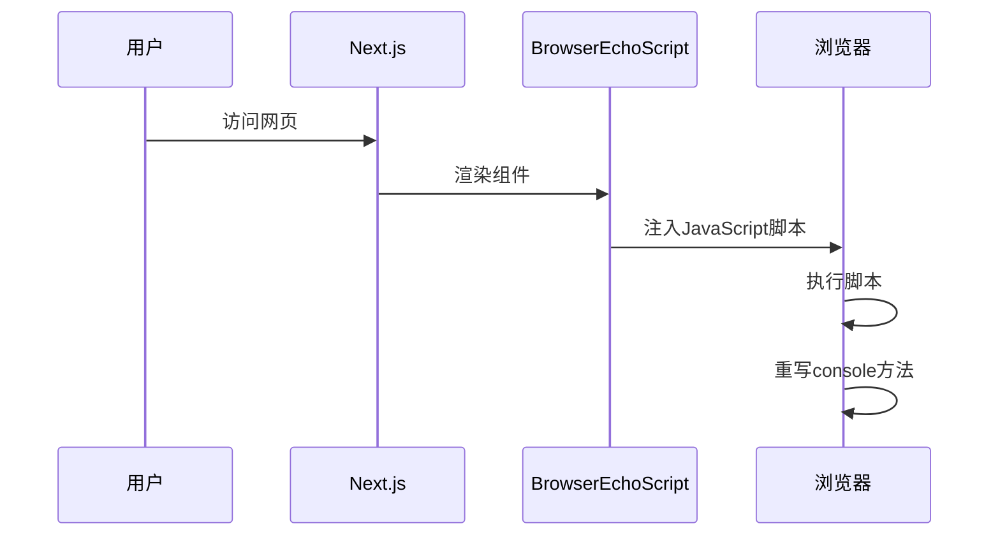

### 2. 日志捕获阶段

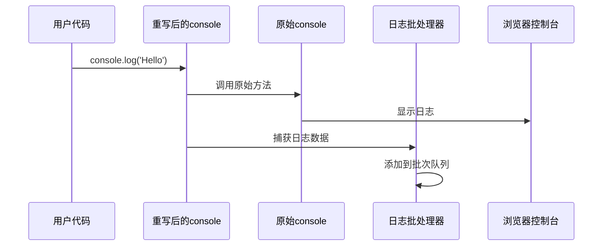

### 3. 日志传输阶段

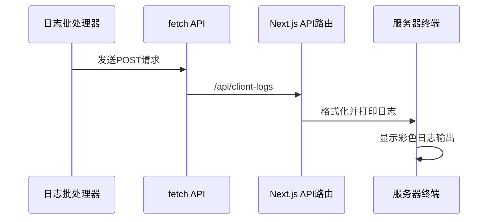

## 关键技术实现

### 1. Console 方法重写

Browser Echo 的核心是重写浏览器的 `console` 对象：

```javascript
// 简化的实现原理
const originalConsole = {
  log: console.log,
  warn: console.warn,
  error: console.error,
  info: console.info,
  debug: console.debug,
};

// 重写console方法
console.log = function (...args) {
  // 1. 调用原始方法（保持原有行为）
  originalConsole.log.apply(console, args);

  // 2. 捕获日志数据
  const logData = {
    level: "log",
    message: args,
    timestamp: new Date().toISOString(),
    stack: new Error().stack,
  };

  // 3. 发送到服务器
  sendToServer(logData);
};
```

### 2. 日志批处理机制

为了避免频繁的网络请求，Browser Echo 使用批处理：

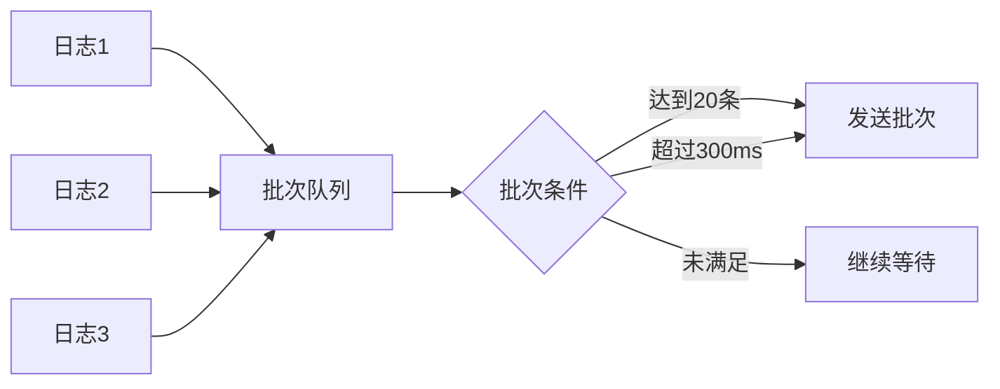

### 3. 网络传输优化

Browser Echo 使用多种传输策略：

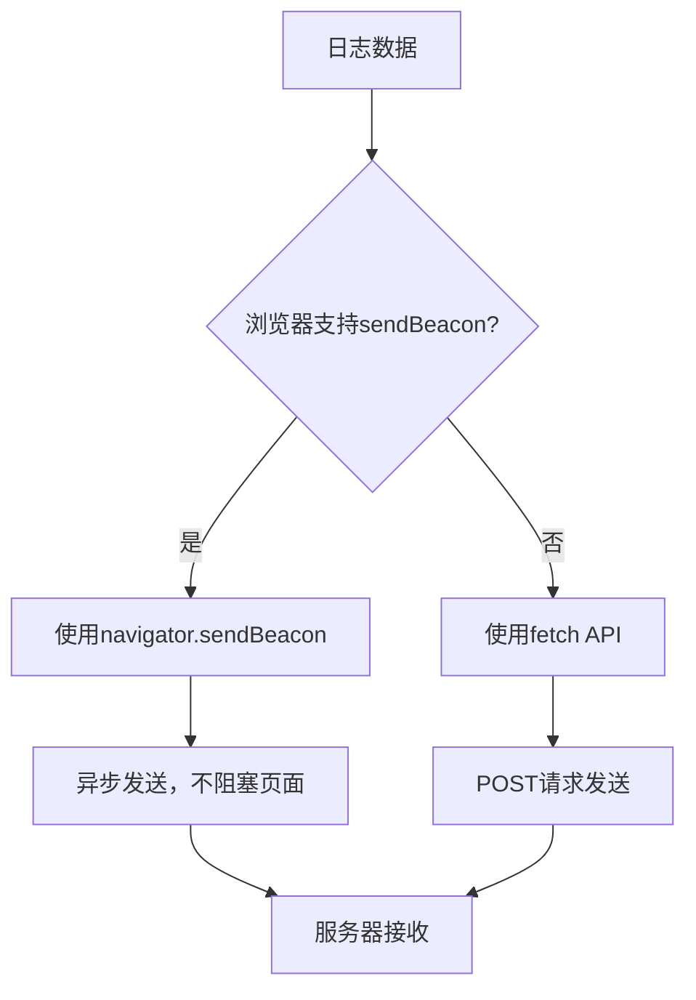

## Next.js 集成原理

### 1. App Router 集成

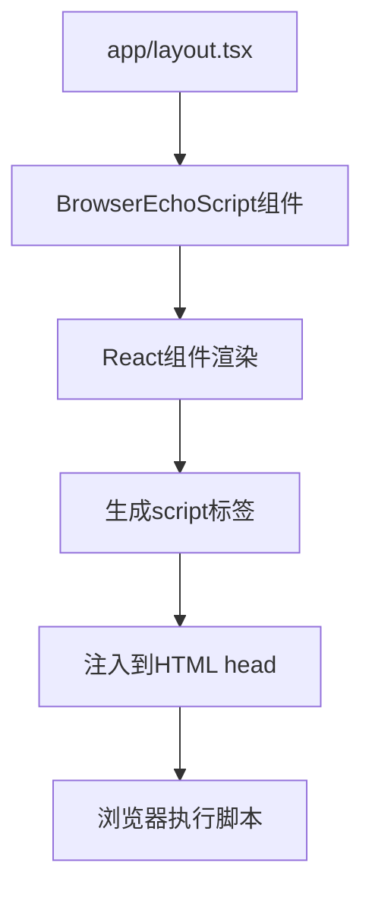

### 2. API 路由处理

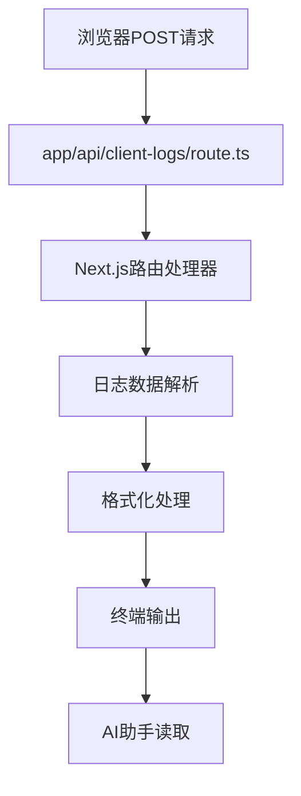

## 性能优化策略

### 1. 开发环境限制

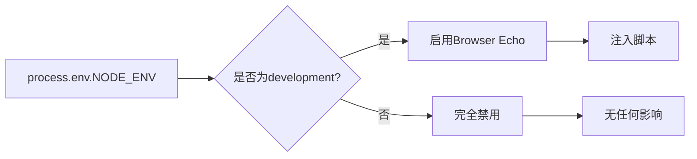

### 2. 条件渲染

```tsx
// 只在开发模式下渲染
{
  process.env.NODE_ENV === "development" && <BrowserEchoScript />;
}
```

### 3. 批量发送

```javascript
// 批处理配置
const batchConfig = {
  size: 20, // 最多20条日志一批
  interval: 300, // 最多300ms发送一次
};
```

## 错误处理机制

### 1. 网络错误处理

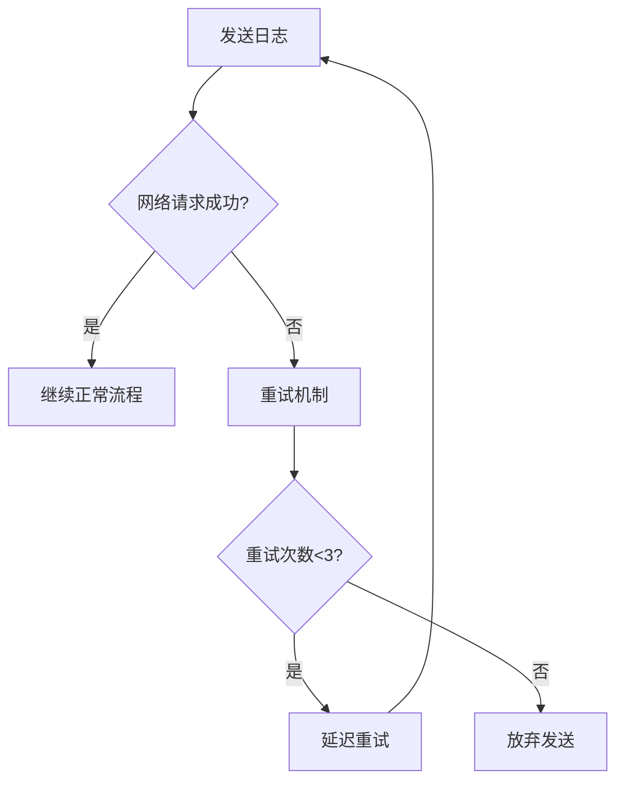

### 2. 降级策略

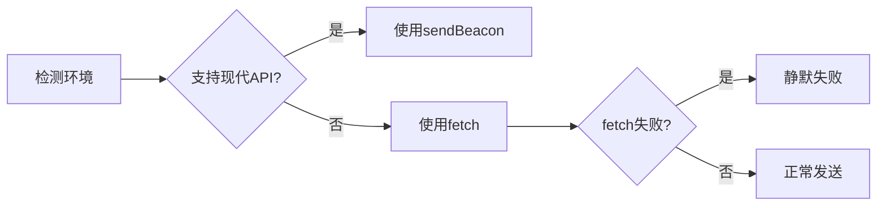

## 与 AI 助手集成原理

### 1. 终端输出集成

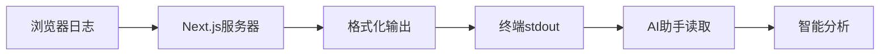

### 2. MCP 服务器集成

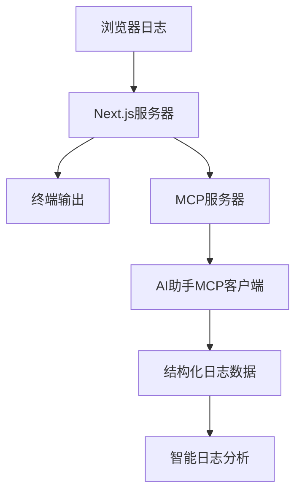

## 安全性考虑

### 1. 开发环境限制

- 只在 `NODE_ENV=development` 时启用
- 生产环境完全禁用，无任何影响

### 2. 数据安全

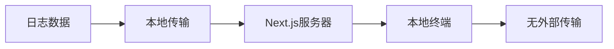

### 3. 性能影响

- 轻量级实现，对页面性能影响极小
- 使用批处理减少网络请求
- 异步发送不阻塞页面渲染

## 调试和故障排除

### 1. 检查清单

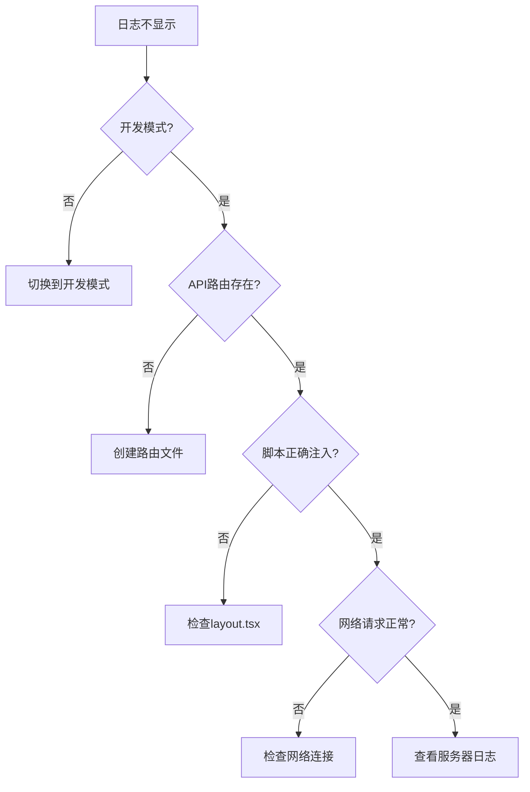

### 2. 常见问题

| 问题         | 原因                 | 解决方案                            |
| ------------ | -------------------- | ----------------------------------- |
| 看不到日志   | 不在开发模式         | 确保 `NODE_ENV=development`         |
| API 404 错误 | 路由文件不存在       | 运行 `npx @browser-echo/next setup` |
| 日志重复     | preserveConsole=true | 设置为 false 或保持默认             |
| 性能问题     | 日志过多             | 使用 `include` 过滤日志类型         |

## 总结

Browser Echo 在 Next.js 中的实现是一个优雅的解决方案：

1. **非侵入式**：通过重写 console 方法实现，不影响原有代码
2. **高性能**：使用批处理和异步传输优化性能
3. **安全可靠**：只在开发环境启用，生产环境无影响
4. **易于集成**：简单的 API 和组件接口
5. **AI 友好**：完美适配 AI 助手的开发工作流

这种设计让开发者能够无缝地将浏览器调试信息集成到他们的开发环境中，特别是与 AI 助手的协作变得更加高效。
